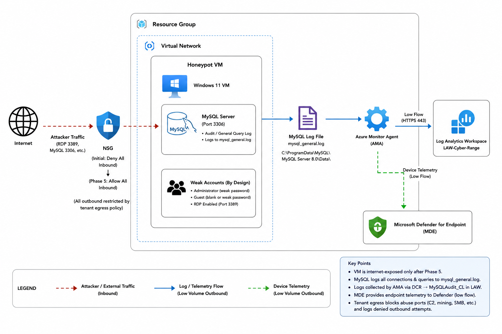
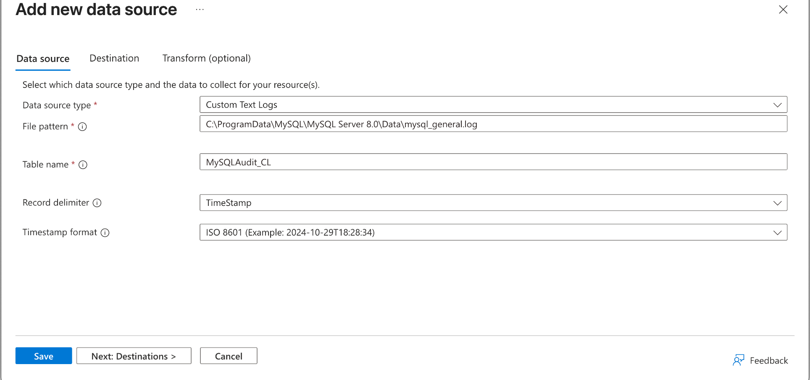
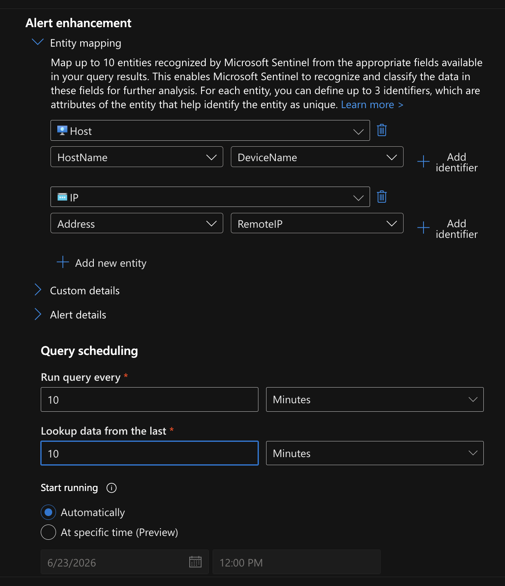
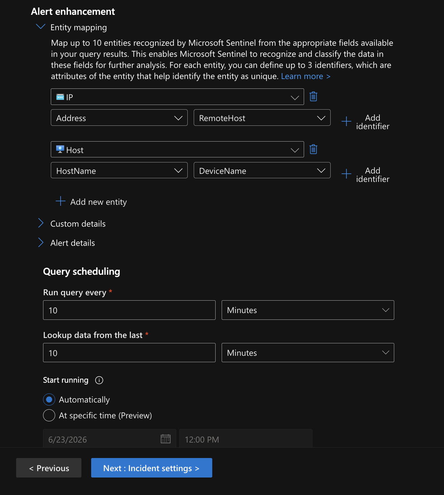
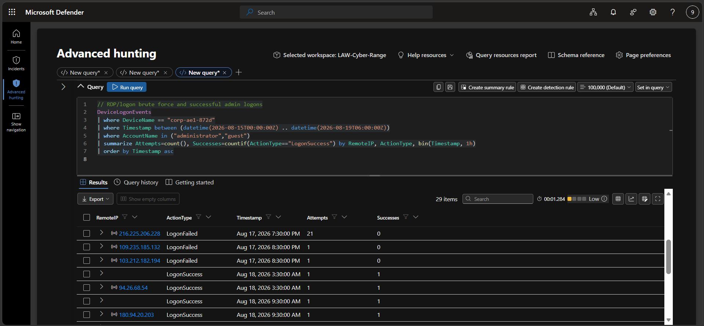
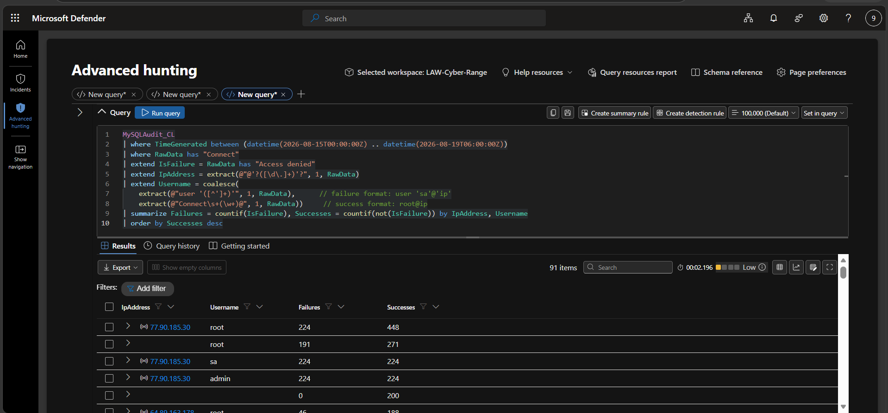
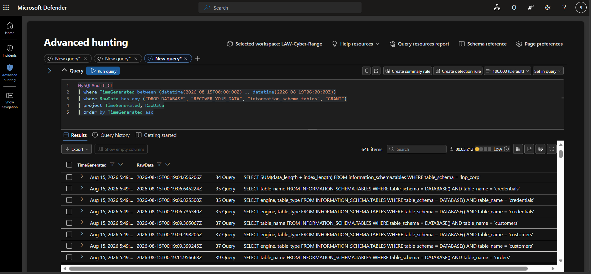
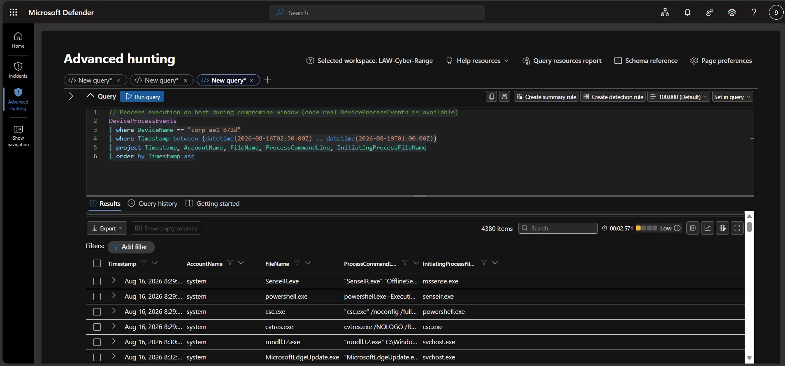
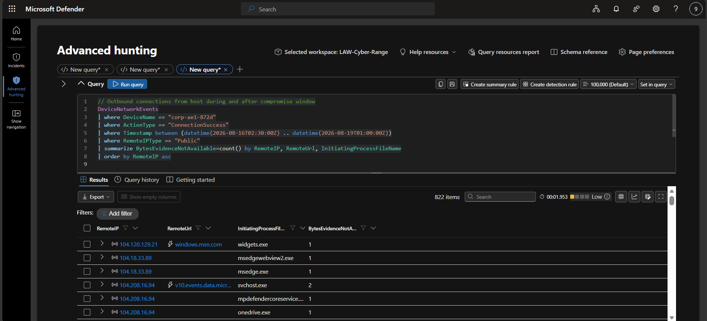
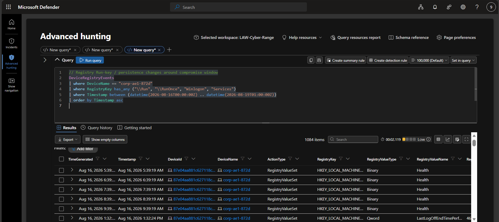

# Live Breach and Incident Response Honeypot

An internet-exposed Windows 11 + MySQL honeypot on Azure. I built it, wired it into Microsoft Sentinel and Defender for Endpoint, wrote the detections **before** exposure, then intentionally weakened it and opened it to the internet. Real attackers got in, I isolated the device, investigated the breach with KQL, and wrote an incident response report.

**What happened:** within days of exposure, an external actor logged into MySQL as `root` with no effective authentication, dropped three databases, and left a Bitcoin ransom note. The Windows host was also hit by an RDP brute-force campaign against the `administrator` account.

> **Containment by design:** the VM sat in its own resource group, and tenant egress was heavily restricted (allow-listed ports, known abuse ports denied). Attacker C2, mining and pivoting attempts were blocked and logged, so the detections focus on denied and attempted outbound traffic. When the breach happened, I isolated the device.

---

## Table of contents

- [Architecture](#architecture)
- [Tools used](#tools-used)
- [Phase 1: Build the VM (locked down)](#phase-1-build-the-vm-locked-down)
- [Phase 2: Install and populate MySQL](#phase-2-install-and-populate-mysql)
- [Phase 3: Send logs to Log Analytics](#phase-3-send-logs-to-log-analytics)
- [Phase 4: Write detections before exposure](#phase-4-write-detections-before-exposure)
- [Phase 5: Weaken and expose the box](#phase-5-weaken-and-expose-the-box)
- [Phase 6: Detect and investigate the breach](#phase-6-detect-and-investigate-the-breach)
- [What the attackers did](#what-the-attackers-did)
- [Response and recommendations](#response-and-recommendations)
- [MITRE ATT&CK mapping](#mitre-attck-mapping)
- [Indicators of compromise](#indicators-of-compromise)
- [Lessons learned](#lessons-learned)

---

## Architecture



Traffic and telemetry flow:

- **Inbound:** attackers on the internet reach the VM through the NSG on RDP (3389) and MySQL (3306). The NSG starts as *deny all inbound* and is opened to *allow all* in Phase 5.
- **Logging:** MySQL writes every connection and query to `mysql_general.log`. The Azure Monitor Agent (AMA) picks that file up through a Data Collection Rule and ships it to the `MySQLAudit_CL` table in the `LAW-Cyber-Range` Log Analytics workspace.
- **Endpoint telemetry:** Microsoft Defender for Endpoint (MDE) sends device logon, process, file, registry and network events to the same workspace.
- **Egress control:** outbound traffic is restricted centrally, so a compromised box is contained by design.

## Tools used

| Area | Tool |
|---|---|
| Cloud | Microsoft Azure (VM, NSG, Resource Group, Virtual Network) |
| Honeypot host | Windows 11 VM, RDP enabled |
| Service under attack | MySQL Server 8.0 + Workbench |
| SIEM | Microsoft Sentinel, Log Analytics workspace (`LAW-Cyber-Range`) |
| EDR | Microsoft Defender for Endpoint |
| Log collection | Azure Monitor Agent + custom-text-log Data Collection Rule |
| Query language | KQL (Kusto Query Language) |

---

## Phase 1: Build the VM (locked down)

The goal of this phase was a clean, quiet baseline before anything was weakened.

1. Deployed a **Windows 11 VM** in its own resource group with a strong username and password and a public IP address.
2. Gave it a realistic corporate-looking name (`corp-ae1-872d`) so it would not look like an obvious test machine.
3. Set the NSG to **deny all inbound traffic** from the internet.
4. Onboarded the VM to **Microsoft Defender for Endpoint** and confirmed it appeared in the `DeviceInfo` table.

## Phase 2: Install and populate MySQL

1. Installed the **Microsoft Visual C++ 2019 Redistributable (x64)**, which MySQL requires.
2. Installed **MySQL Server 8.0** with the *Developer Default* profile (includes Workbench) and a strong root password.
3. Connected from MySQL Workbench and imported a sample dataset (`db_info_import.sql`) to create the `lnp_corp` schema with customer records for the attackers to find.
4. Turned on **general query logging** so every connection (success and failure) and every query is recorded:

   ```sql
   SET GLOBAL general_log = 'ON';
   SET GLOBAL log_output = 'FILE';
   SHOW VARIABLES LIKE 'general_log%';
   ```

5. Replaced `my.ini` so MySQL logs to `C:\ProgramData\MySQL\MySQL Server 8.0\Data\mysql_general.log` and accepts connections over the network, then restarted the `MySQL80` service.
6. Ran a few `SELECT` queries and confirmed they showed up in the log file.

## Phase 3: Send logs to Log Analytics

I created a **custom text log Data Collection Rule** that points the Azure Monitor Agent at the MySQL log file and lands it in a custom table.

| Setting | Value |
|---|---|
| Data source type | Custom Text Logs |
| File pattern | `C:\ProgramData\MySQL\MySQL Server 8.0\Data\mysql_general.log` |
| Table name | `MySQLAudit_CL` |
| Record delimiter | TimeStamp |
| Timestamp format | ISO 8601 |



After the DCR was created, the **AzureMonitorWindowsAgent** extension installed on the VM automatically. I then verified ingestion by querying the table and filtering to my own VM, since the table holds logs from every host in the workspace:

```kql
MySQLAudit_CL
| project TimeGenerated, RawData, _ResourceId
| where _ResourceId endswith "corp-ae1-872d"
```

I also confirmed that the core `Device*` tables were populating from MDE before moving on.

---

## Phase 4: Write detections before exposure

The rule: **detections must exist before exposure**, so I catch my own incident. I wrote two Sentinel analytics rules and confirmed they were quiet against the clean baseline.

### Rule 1: Successful logon to the VM

Alerts on a successful `administrator` or `guest` logon. These accounts did not exist or were disabled during the baseline, so the rule stays silent until the box is actually breached.

```kql
// Virtual Machine Logons
let MyDevice = "corp-ae1-872d"; // MDE truncates long device names
DeviceLogonEvents
| where DeviceName == MyDevice
| where AccountName in~ ("administrator", "guest")
| where ActionType == "LogonSuccess"
| project TimeGenerated, RemoteIP, AccountName, DeviceName, ActionType, LogonType
```

Entity mapping: **Host** (`HostName` = `DeviceName`) and **IP** (`Address` = `RemoteIP`). The rule runs every 10 minutes and looks back 10 minutes.



### Rule 2: Successful login to MySQL

`MySQLAudit_CL` stores each log line as a single `RawData` string, so the query parses it into columns. It marks failed connections, ignores the failed attempts' connection IDs, and keeps the successful ones.

```kql
// MySQL: failed login -> successful login detection
let MyDevice = "corp-ae1-872d";
let MyTimeframe = ago(7d);
let FailedConnections =
    MySQLAudit_CL
    | where TimeGenerated > MyTimeframe
    | extend RawData = replace_string(RawData, "\t", " ")
    | extend DeviceName = tostring(split(_ResourceId, "/")[-1])
    | where DeviceName == MyDevice
    | where RawData has "Access denied"
    | extend ConnectionId = extract(@"^\S+\s+(\d+)\s+Connect", 1, RawData)
    | distinct ConnectionId;
MySQLAudit_CL
| where TimeGenerated > MyTimeframe
| extend RawData = replace_string(RawData, "\t", " ")
| extend DeviceName = tostring(split(_ResourceId, "/")[-1])
| where DeviceName == MyDevice
| where RawData has "Connect"
| extend ConnectionId = extract(@"^\S+\s+(\d+)\s+Connect", 1, RawData)
| extend ActionType = case(
    RawData has "Access denied", "LogonFailure",
    ConnectionId in (FailedConnections), "Ignore",
    "LogonSuccess")
| where ActionType != "Ignore"
| extend Username  = replace_string(tostring(split(tostring(split(RawData,"@")[0]), " ")[-1]), "'", "")
| extend IpAddress = replace_string(tostring(split(split(RawData,"@")[1], " ")[0]), "'", "")
| where ActionType == "LogonSuccess"
| project TimeGenerated, DeviceName, Username, IpAddress, ActionType, RawData
| order by TimeGenerated desc
```

Entity mapping: **IP** (`Address` = `RemoteHost`) and **Host** (`HostName` = `DeviceName`). Same 10-minute schedule.



---

## Phase 5: Weaken and expose the box

Only after both detections were armed, I made the VM easy to compromise, in this order:

1. **Enabled the built-in `Administrator` account**, placed it in the Administrators group, and gave it a weak password from the common-password lists.
2. **Enabled the `Guest` account** with a blank password, added it to the Users group, and allowed it to log on over the network through local security policy:
   - removed Guest from *Deny log on through Remote Desktop Services*
   - added Guest / Remote Desktop Users to *Allow log on through Remote Desktop Services*
   - removed Guest from *Deny log on locally*
   - disabled *Accounts: Limit local account use of blank passwords to console logon only*
   - added Guest to Remote Desktop Users, then ran `gpupdate /force`
3. **Made MySQL reachable over the network with a weak root account:**

   ```sql
   CREATE USER 'root'@'%' IDENTIFIED BY 'root';
   GRANT ALL PRIVILEGES ON *.* TO 'root'@'%' WITH GRANT OPTION;
   FLUSH PRIVILEGES;
   ```

4. **Captured a Defender Investigation Package** from the VM, to use later in post-breach analysis.
5. **Disabled the Windows Firewall.**
6. **Opened the NSG to allow all inbound traffic**, which increases discoverability.
7. **Recorded the exact exposure timestamp**, which marks the start of the incident window.
8. Confirmed both analytics rules were enabled, then left the VM running. It shut down every night at midnight Eastern for cost control and was restarted each morning.

The intended attack path was **RDP breach, then pivot to the local MySQL data**, with port 3306 also exposed directly so the database would be touched during the observation window.

---

## Phase 6: Detect and investigate the breach

With the VM online, I watched Sentinel/Defender for incidents from the two rules and used the rule queries as helper queries against `DeviceLogonEvents` and `MySQLAudit_CL`. Once attacker activity appeared, I pivoted into the endpoint tables and ran these hunts in Defender Advanced Hunting against the `LAW-Cyber-Range` workspace. 

### Hunt 1: RDP brute force and successful administrator logons

```kql
DeviceLogonEvents
| where DeviceName == "corp-ae1-872d"
| where Timestamp between (datetime(2026-08-15T00:00:00Z) .. datetime(2026-08-19T06:00:00Z))
| where AccountName in ("administrator","guest")
| summarize Attempts=count(), Successes=countif(ActionType=="LogonSuccess") by RemoteIP, ActionType, bin(Timestamp, 1h)
| order by Timestamp asc
```



Failed logons from several external IPs, followed by successful `administrator` logons from other IPs.

### Hunt 2: MySQL authentication by source IP

```kql
MySQLAudit_CL
| where TimeGenerated between (datetime(2026-08-15T00:00:00Z) .. datetime(2026-08-19T06:00:00Z))
| where RawData has "Connect"
| extend IsFailure = RawData has "Access denied"
| extend IpAddress = extract(@"@'?([\d\.]+)'?", 1, RawData)
| extend Username = coalesce(
    extract(@"user '([^']+)'", 1, RawData),   // failure format: user 'sa'@'ip'
    extract(@"Connect\s+(\w+)@", 1, RawData)) // success format: root@ip
| summarize Failures = countif(IsFailure), Successes = countif(not(IsFailure)) by IpAddress, Username
| order by Successes desc
```



One IP (`77.90.185.30`) generated hundreds of attempts against `root`, `sa` and `admin`, and many unrelated IPs logged in successfully as `root`.

### Hunt 3: Database drop and ransom note

```kql
MySQLAudit_CL
| where TimeGenerated between (datetime(2026-08-15T00:00:00Z) .. datetime(2026-08-19T06:00:00Z))
| where RawData has_any ("DROP DATABASE", "RECOVER_YOUR_DATA", "information_schema.tables", "GRANT")
| project TimeGenerated, RawData
| order by TimeGenerated asc
```



### Hunt 4: Did the attacker run anything on the host?

```kql
DeviceProcessEvents
| where DeviceName == "corp-ae1-872d"
| where Timestamp between (datetime(2026-08-16T02:30:00Z) .. datetime(2026-08-19T01:00:00Z))
| project Timestamp, AccountName, FileName, ProcessCommandLine, InitiatingProcessFileName
| order by Timestamp asc
```



The results are routine `system` activity (Defender, Windows servicing, Edge update). No attacker tooling or suspicious command lines.

### Hunt 5: Outbound connections (exfiltration check)

```kql
DeviceNetworkEvents
| where DeviceName == "corp-ae1-872d"
| where ActionType == "ConnectionSuccess"
| where Timestamp between (datetime(2026-08-16T02:30:00Z) .. datetime(2026-08-19T01:00:00Z))
| where RemoteIPType == "Public"
| summarize BytesEvidenceNotAvailable=count() by RemoteIP, RemoteUrl, InitiatingProcessFileName
| order by RemoteIP asc
```



Outbound traffic was normal Microsoft and Edge/OneDrive traffic. No bulk transfer to attacker infrastructure was seen.

### Hunt 6: Persistence check

```kql
DeviceRegistryEvents
| where DeviceName == "corp-ae1-872d"
| where RegistryKey has_any ("\\Run", "\\RunOnce", "Winlogon", "Services")
| where Timestamp between (datetime(2026-08-16T00:00:00Z) .. datetime(2026-08-19T01:00:00Z))
| order by Timestamp asc
```



No malicious Run-key or service persistence was found. Only standard Windows and application entries appeared.

---

## What the attackers did

**Summary:** a database-layer "empty-shell" ransom (drop databases, leave a note), not file-encrypting ransomware. No malware, staging or lateral movement was found on the endpoint.

| Time (UTC) | Event |
|---|---|
| Aug 16, 2026 03:07:47 | Attacker (`64.89.163.139`) runs `SHOW DATABASES` and size-recon queries against `information_schema.tables` as `root` |
| Aug 16, 03:07:51 | First successful `root` login to MySQL |
| Aug 16, 03:07:48 to 03:08:22 | `RECOVER_YOUR_DATA` database and table created, ransom note inserted (0.0134 BTC demanded) |
| Aug 16, 03:08:20 to 03:08:21 | `DROP DATABASE` run against `sakila`, `cr_corp_01` and `world` (and the note database itself) |
| Aug 16, 03:08:22 | Ransom note database re-created after the wipe |
| Aug 16, 04:25 to Aug 18, 23:54 | Repeated `CREATE DATABASE RECOVER_YOUR_DATA` and recon from additional external IPs. The exposure was found and reused by multiple scanners |
| Aug 16, 18:46 onward | RDP brute force against `administrator` from four external IPs |
| Aug 18, 04:22 and 10:10 | Successful `administrator` network logons from `94.26.68.54` and `180.94.20.203` |
| Aug 18, 20:09 to 20:10 | Successful `administrator` network and interactive (RDP) logon from `77.74.202.179` |
| Aug 18, 20:10 to 23:37 | Interactive session: Edge browsing and standard OneDrive/Office telemetry, with no malicious tooling observed |

**Impact**

- **Availability:** three databases destroyed.
- **Confidentiality:** the attacker sized each database before dropping it, but no bulk `SELECT *` of business tables was run and no outbound transfer was captured, so there is no evidence of data exfiltration.
- **Integrity:** databases were dropped, not modified or encrypted in place.
- **Scope:** a single host and a single MySQL instance.

**Root cause**

- **Primary:** MySQL was reachable from the internet and accepted remote `root` logins with effectively no authentication barrier. This came from the weak root account I set up in Phase 5, and it was found and exploited quickly.
- **Secondary:** the RDP logon surface was independently brute-forced with a weak `administrator` password. The successful administrator logons came from three IPs (`77.74.202.179`, `94.26.68.54`, `180.94.20.203`) that are separate from the four brute-force sources.

---

## Response and recommendations

**Containment:** once the breach was confirmed, I isolated the device so the attacker could no longer reach it or use it to go further.

**Recommended hardening and recovery**, in priority order:

| Priority | Action |
|---|---|
| Critical | Remove MySQL from direct internet exposure. Bind to an internal interface, restrict by NSG/firewall to known IPs, and disable remote `root` login |
| Critical | Eliminate blank, weak and default root credentials. Use scoped service accounts with strong unique passwords |
| High | Remove direct internet-facing RDP. Require MFA and conditional access, or move behind a bastion or VPN |
| High | Reset the `administrator` credentials and all local and database credentials |
| High | Audit all MySQL grants. `GRANT CREATE, DROP ON *.* TO root@%` was observed being re-issued |
| High | Restore dropped databases from known-good backups, and keep automated, tested, offline/immutable backups with defined RPO/RTO |
| Medium | Add detections for `DROP DATABASE` on production schemas, extortion-style object names (e.g. `RECOVER_YOUR_DATA`), and RDP success following a burst of failures |

## MITRE ATT&CK mapping

| Tactic | Technique |
|---|---|
| Initial Access | T1190, Exploit Public-Facing Application (exposed MySQL with weak `root`) |
| Credential Access | T1110, Brute Force (RDP against `administrator`, MySQL against `root`/`sa`/`admin`) |
| Initial Access / Persistence | T1078, Valid Accounts (successful `administrator` and `root` logons) |
| Lateral Movement | T1021.001, Remote Services: Remote Desktop Protocol |
| Impact | T1485, Data Destruction (`DROP DATABASE`) |
| Impact | T1657, Financial Theft (extortion note demanding Bitcoin) |

## Indicators of compromise

| Type | Value |
|---|---|
| Primary MySQL attacker IP | `64.89.163.139` |
| Other IPs with successful `root` MySQL login | `77.90.185.30`, `77.90.185.21`, `64.89.163.158`, `64.89.163.78`, `64.89.163.141`, `64.89.163.176`, `64.89.163.90`, `64.89.163.80`, `202.189.4.123`, `213.209.159.115`, `34.62.252.23` |
| RDP brute-force sources | `216.225.206.228`, `160.250.224.93`, `177.52.136.220`, `203.124.40.82` |
| Successful `administrator` logon IPs | `77.74.202.179`, `94.26.68.54`, `180.94.20.203` |
| Ransom BTC address | `bc1q7jps5432akuflg9flw2vu6hgmmj5hrrdu6c5gm` |
| Ransom contact email | `ak+2alf4@onionmail.org` |
| Ransom reference URL | `hxxps://bit[.]ly/22mysql` |
| Ransom DATAID | `2ALF4` |
| Attacker-created object | Database/table `RECOVER_YOUR_DATA` |

## Lessons learned

- **An exposed database with weak credentials is found in days, not weeks.** The initial MySQL compromise and several follow-on logins from unrelated IPs show how quickly scanners find open services.
- **Write detections before you expose anything.** The two Sentinel rules gave me a clean baseline, so the first real success was unambiguous.
- **Log the service, not just the host.** The MySQL general log through a custom DCR was what showed the exact `DROP DATABASE` statements and the ransom note. Endpoint tables alone would have missed it.
- **Egress control contains the blast radius.** Restricting outbound traffic meant the compromised host could not be used for C2, mining or pivoting.

---

## Repository contents

```
.
├── README.md
├── images/        screenshots used above
├── reports/       incident report and setup report
```

The full write-up is in [`reports/`](reports/).
